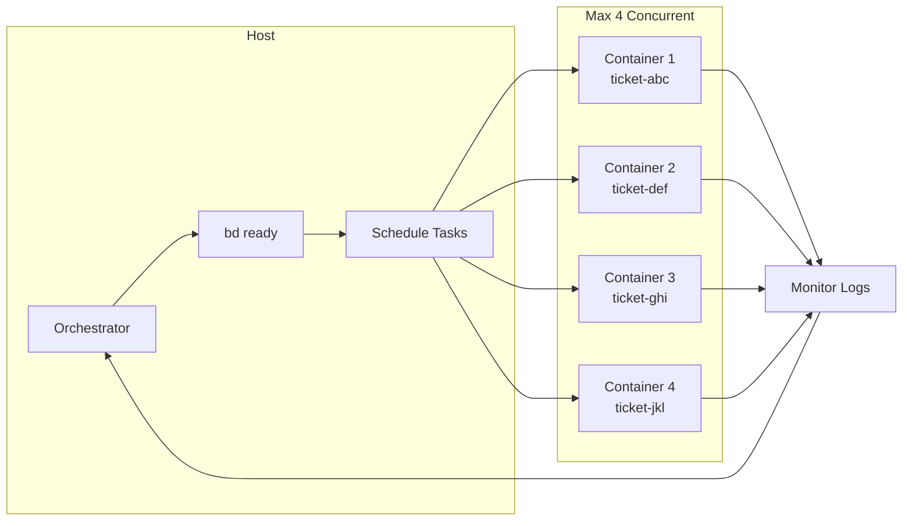

# Agent Prompts

Reusable prompts for AI coding agents, designed to be included as a git submodule.

> [!NOTE]
> This framework assumes Rust, Mise, and Beads. The principles apply broadly, but the prompts reference these tools directly.

## The Problem

AI coding agents fail in predictable ways:

| Failure Mode | Cause | Symptom |
|--------------|-------|---------|
| **Attention drift** | Large context windows | Agent "forgets" earlier instructions, hallucinates file paths |
| **Scope creep** | No explicit boundaries | Simple bug fix becomes architectural refactor |
| **Context exhaustion** | Dumping entire codebase | Token limits hit mid-task, work lost |
| **Coordination chaos** | No persistent state | Multi-session work loses continuity |

The root cause: **agents need structure, not just capability**.

## The Solution

This framework addresses each failure mode:

### 1. Attention-Directing Prompts

Instead of dumping files into context, we curate precisely what the agent needs:

```xml
<files>
  <file path="src/main.rs" mode="full"/>        <!-- Editing this -->
  <file path="src/lib.rs" mode="codemap"/>      <!-- Reference only -->
  <file path="src/utils.rs" mode="slice" lines="45-80"/>  <!-- Just this function -->
</files>
```

| Mode | Tokens | Use Case |
|------|--------|----------|
| `full` | 100% | Files being edited |
| `codemap` | ~10% | Signatures, types, interfaces |
| `slice` | Variable | Specific line ranges |

### 2. Agentic Project Management

Work is tracked in git-native tickets (Beads), enabling:

- **Dependency graphs** — Agents know what's ready via `bd ready`
- **Status tracking** — `open → in_progress → blocked → closed`
- **Context persistence** — Tickets survive session boundaries and compaction

### 3. Human-in-the-Loop Gates

Agents don't push to main. The workflow enforces review:

```
Agent completes → Status: blocked → Human reviews → Merged or feedback
```

## How It Works

### Stage Details

| Stage | Input | Output | Actor |
|-------|-------|--------|-------|
| PRD Creation | Feature request | `prds/prd-*.md` | Human or AI + review |
| Task Generation | PRD file | Epic + tasks (`bd create`) | AI agent |
| Context Prep | Task ID | XML context in description | AI agent |
| Execution | Task with context | Code changes, branch | Container agent |
| Review | Blocked tasks | Merged or feedback | Human reviewer |

### Orchestrator Pattern

The host orchestrator manages parallel task execution:




## Tooling Philosophy: Shift Left

These tools catch problems before agents encounter them:

### Rust

- **Compile-time safety** — Type errors caught before runtime, reducing agent debugging loops
- **Self-documenting types** — Agents reason about `Result<User, AuthError>` better than `any`
- **Predictable builds** — `cargo build` either works or gives actionable errors

### Mise

- **Declarative tasks** — `mise run test` behaves identically everywhere
- **Reproducible environments** — Tool versions pinned, no "works on my machine"
- **Composable workflows** — Tasks chain predictably: `fmt → lint → test → build`

### Beads

- **Git-native tickets** — Issues stored as files, travel with the code
- **Dependency graphs** — `bd ready` returns only unblocked work
- **Session resilience** — Context survives compaction, agents resume cleanly

## Getting Started

### Installation

```bash
# Add as submodule
git submodule add https://github.com/l1x/agent-prompts.git .agent-prompts

# Update prompts
git submodule update --remote
```

### Container Setup

```bash
# Build agent container
DOCKER_BUILDKIT=1 docker build \
  --progress=plain \
  --no-cache \
  -t agent-base:0.1.0 \
  -f containers/agent-base.Dockerfile \
  containers/
```

## Prompt Reference

The `do/` directory contains stage-specific prompts:

| Prompt | Purpose | Input | Output |
|--------|---------|-------|--------|
| `create-prd.md` | Generate PRD from feature request | User prompt | `prds/prd-*.md` |
| `generate-tasks.md` | Decompose PRD into tickets | PRD file | Epic + tasks in Beads |
| `prepare-task.md` | Curate context for task | Task ID | XML context spec |
| `execute-task.md` | Implement single task | Task with context | Code changes |
| `execute-epic.md` | Orchestrate parallel execution | Epic ID | Completed tasks |

The `context/` directory contains reference material:

| File | Purpose |
|------|---------|
| `project-management.md` | Beads workflow, dot notation, dependencies |
