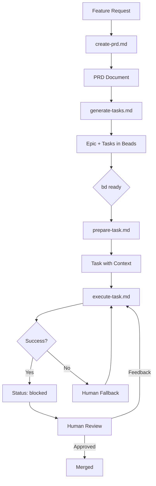
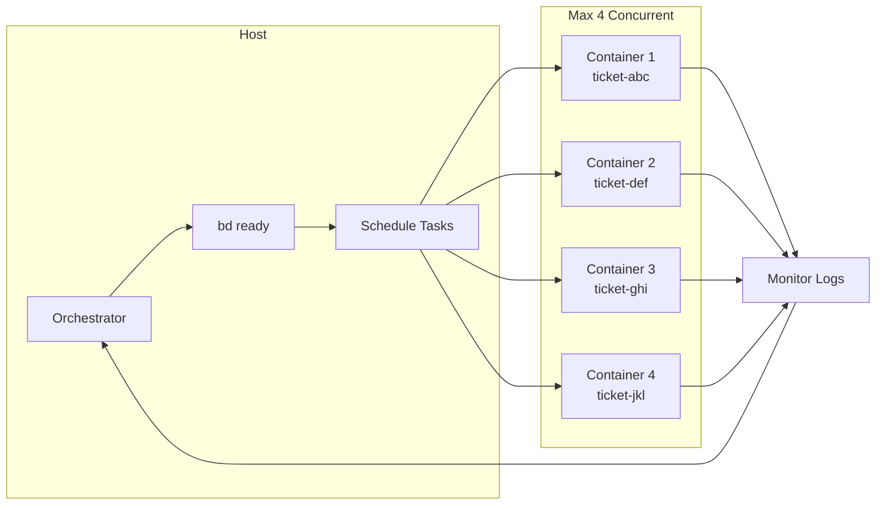
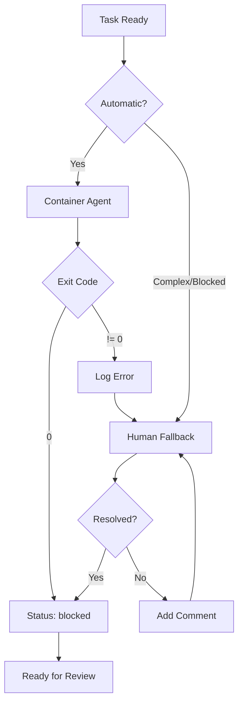

# Agent prompts

Reusable prompts for AI agents, designed to be included as a git submodule.

> [!IMPORTANT]
> Right now it assumes you are using Rust, Mise and Beads.

## Getting Started

```bash
git submodule add https://github.com/l1x/agent-prompts.git .agent-prompts
```

## Updating Prompts

```bash
git submodule update --remote
```

## Required Tooling

These prompts assume the following tools are available in your project:

### mise

[mise](https://mise.jdx.dev/) is a polyglot runtime and task runner. The prompts reference `mise run` commands for common development tasks:

- `mise run task`

Configure tasks in your project's `mise.toml` or `.mise.toml` file.

### beads (bd)

[Beads](https://github.com/beads-project/beads) is a git-native issue tracker for AI-assisted development. It stores tickets as files in your repository, enabling agents to create, update, and track work items.

Key commands used in these prompts:

- `bd quickstart` — Getting the agent onboard

## Agentic Container

```bash
DOCKER_BUILDKIT=1 docker build --progress=plain --no-cache -t agent-base:0.1.0 -f containers/agent-base.Dockerfile containers/
```

## Architecture Summary

```
 ┌─────────────────────────────────────────────────────────┐
 │  Orchestrator (Claude Code on host)                     │
 │  - Runs: bd ready                                       │
 │  - Spawns: up to 4 containers                           │
 │  - Monitors: docker logs, bd status                     │
 └─────────────────────────┬───────────────────────────────┘
                           │
         ┌─────────────────┼─────────────────┐
         ▼                 ▼                 ▼
 ┌──────────────┐  ┌──────────────┐  ┌──────────────┐
 │ Container 1  │  │ Container 2  │  │ Container 3  │
 │ ticket-abc   │  │ ticket-def   │  │ ticket-ghi   │
 │              │  │              │  │              │
 │ mise run:    │  │ mise run:    │  │ mise run:    │
 │  git→repo→   │  │  git→repo→   │  │  git→repo→   │
 │  branch→     │  │  branch→     │  │  branch→     │
 │  agent       │  │  agent       │  │  agent       │
 └──────────────┘  └──────────────┘  └──────────────┘
```

## Workflow

The development workflow follows a structured pipeline from feature request to merged code:



### Stage Details

| Stage | Input | Output | Actor |
|-------|-------|--------|-------|
| PRD Creation | Feature request | `prds/prd-*.md` | Human or AI + review |
| Task Generation | PRD file | Epic + tasks (`bd create`) | AI agent |
| Context Prep | Task ID | XML context in description | AI agent |
| Execution | Task with context | Code changes, branch | Container agent |
| Review | Blocked tasks | Merged or feedback | Human reviewer |

### Orchestrator Pattern

The host orchestrator manages parallel task execution:



### Execution Modes

Tasks can be executed automatically or with human intervention:


